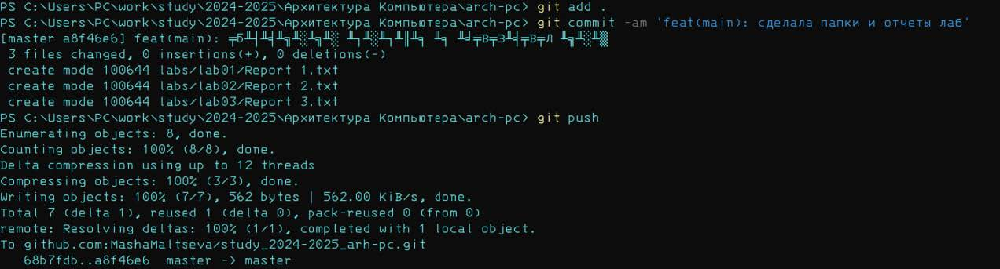

# РОССИЙСКИЙ УНИВЕРСИТЕТ ДРУЖБЫ НАРОДОВ
## Факультет физико-математических и естественных наук  
## Кафедра прикладной информатики и теории вероятностей

### ОТЧЁТ  
### ПО ЛАБОРАТОРНОЙ РАБОТЕ №2  
**Тема**: «Система контроля версий Git»

**Выполнил студент 1 курса**:  
Мальцева Мария Георгиевна 
Группа: НКАбд-03-24  

**Москва, 2024 г.**

---

### Цель работы
Результаты выполнения лабораторной работы
Описание выполняемого задания
1. Изучить теоретические основы системы контроля версий Git:
- Понять назначение и основные принципы работы системы контроля
версий.
- Ознакомиться с командами для работы с локальными и удаленными
репозиториями.
2. Освоить базовые команды Git:
- Настроить git на локальном компьютере.
- Научиться создавать и инициализировать репозитории, управлять
ветками и изменениями, а также синхронизировать их с удаленным
репозиторием.
3. Настроить рабочее пространство и структуру проекта:
- Создать каталог для работы над проектом, организовать структуру
каталогов и файлов.
- Создать и настроить репозиторий на GitHub, настроить доступ через
SSH.
4. Приобрести навыки работы с ветками и разрешением конфликтов:
- Научиться создавать новые ветки для работы над различными
задачами.
- Освоить процедуру слияния веток и разрешения конфликтов,
возникающих при одновременной работе нескольких участников.

Описание выполняемого задания
В ходе лабораторной работы я изучила основные команды и принципы работы с
системой контроля версий Git. Моим заданием было настроить локальный
репозиторий, научиться выполнять базовые операции, такие как добавление
файлов, создание коммитов, работа с ветками, а также взаимодействие с
удалённым репозиторием на GitHub.

Сначала я установила Git и выполнила базовую настройку, указав имя
пользователя и email, которые будут отображаться в коммитах. Затем создала
новый локальный репозиторий, добавила в него несколько файлов и сделала
коммит. Важным этапом было изучение работы с ветками: я создала новую ветку,
вносила в ней изменения и выполняла их слияние с основной веткой.

Для завершения работы я подключила репозиторий к удалённому хранилищу на
GitHub и загрузила туда локальные изменения. Это позволило мне убедиться, что
все действия выполнены корректно и изменения успешно синхронизированы.

---

### Скриншоты выполнения задания лабороторной работы

#### 2.4.1. Базовая настройка Git
- Конфигурация Github

#### 2.4.2. Создание SSH-ключа
- Я сгенерировала пару ключей SSH

#### 2.4.3. Создание рабочего пространства и репозитория курса на основе шаблона
- Я создала каталог для предмета «Архитектура компьютера».

- Созданный репозиторий

- Создание файла для репозитория

- Добавление, Коммит и Git Push для отрпавки изменения в репозитории.

- Изменения которые произошли в репозитории.

### Комментарии и выводы по результатам.

- В результате выполнения лабораторной работы я приобрела базовые навыки работы с
системой контроля версий Git. Я освоила основные команды и операции, научилась
управлять локальными и удалёнными репозиториями.

---

### Выполнение самостоятельной работы

1. Создание и оформление отчета по выполненной лабораторной работе:
- Подготовить отчет по результатам выполненных заданий, включив в
него описание процесса выполнения работы, скриншоты и выводы.
2. Организация и структурирование предыдущих отчетов:
- Перенести отчеты по предыдущим лабораторным работам в
соответствующие каталоги, обеспечив их удобное и логичное
расположение.
3. Загрузка всех отчетов на GitHub:
- Загрузить подготовленные отчеты на GitHub, проверив корректность
настроек и организации рабочего пространства в удаленном
репозитории.

### Результаты выполнения заданий для самостоятельной работы

Основной целью было углубленное изучение работы с Git и GitHub, а также
закрепление теоретических знаний на практике. Вот какие задачи я выполнила:
1. Создание отчёта по лабораторной работе:
- Я создала структуру рабочего пространства на локальном
компьютере, следуя указанной иерархии каталогов.
- Создала текстовый документ, в котором оформила отчёт по
лабораторной работе, включив туда описание задания, скриншоты и
выводы по каждому этапу.
2. Перенос отчётов по предыдущим лабораторным работам:
- Переместила отчёты по первой лабораторной работе в
соответствующие каталоги созданного рабочего пространства.
- Проверила корректность структуры каталогов и наличие всех
необходимых файлов.
3. Загрузка файлов на GitHub:
- Выполнила коммит всех добавленных файлов и загрузила их в
удалённый репозиторий.

#### Скриншоты выполненной работы

- Создание каталога labs, подкаталога lab01-03

- Добавление, коммит, и отправака Git Push в репозиторий.

- Обновленный репозиторий с каталогами и файлами labs

---

### Вывод
Выполнение заданий для самостоятельной работы позволило мне закрепить
навыки управления проектами в Git. Я научилась правильно организовывать
рабочее пространство и эффективно использовать репозитории для хранения и
организации файлов. Особое внимание я уделила правильному оформлению
отчётов и их загрузке на GitHub, что важно для дальнейшего удобства в работе и
возможности совместного доступа.

В ходе выполнения лабораторной работы я изучила основные принципы и
команды системы контроля версий Git. Я приобрела практические навыки по
созданию, управлению и синхронизации локальных и удалённых репозиториев.
Теперь я понимаю, как использовать Git для отслеживания изменений в проекте,
управления ветками и устранения конфликтов при работе в команде.