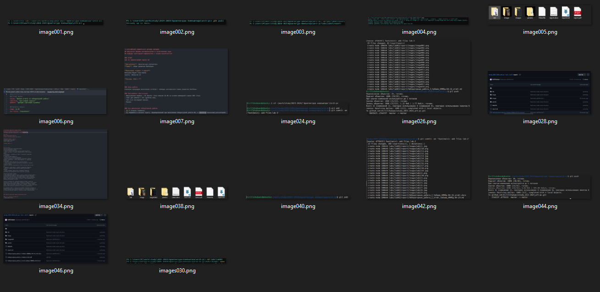

 # РОССИЙСКИЙ УНИВЕРСИТЕТ ДРУЖБЫ НАРОДОВ ИМЕНИ ПАТРИСА ЛУМУМБЫ
## Факультет физико-математических и естественных наук  

### ОТЧЁТ  
### ПО ЛАБОРАТОРНОЙ РАБОТЕ №3  
**Тема**: «Язык разметки Markdown»

**Выполнил студент 1 курса**:  
Чубаев Кирилл Евгеньевич  
Группа: НММбд-04-24  

**Москва, 2024 г.**

---

### Цель работы
Освоение процедуры выполнения отчётов с помощью легковесного языка разметки Markdown.

### Программное обеспечение
- Виртуальная машина с ОС Ubuntu Linux версии 25.4 на основе командной строки GNU Linux.
- Сайт для работы с Git (github.com).
- TeX Live последней версии.
- Pandoc
---

### Ход выполнения лабораторной работы
  1) Я открыл терминал;
  2) Перешел в каталог курса, сформированный при выполнении лабораторной работы №2, и обновил локальный репозиторий:

  3) Перешел в каталог с шаблоном отчета по лабораторной работе № 3:

  4) Далее провёл компиляцию шаблона с использованием Makefile. Для этого ввёл команду make:

  Компиляция прошла успешно, сгенерировались файлы report.docx и report.pdf:

  Проверяю корректность полученных файлов:

  5) Я удалил полученные файлы с использованием Makefile с помощью команды make clean:

  6) Я открыл файл report.md с помощью текстового редактора gedit.

  Далее я внимательно изучил структуру файла:

  7) Далее я начал заполнять отчёт с использованием Markdown:

  Для корректного изображения скриншотов я разместил их в каталоге images:

  8) Выполненный отчёт с использованием Markdown я загрузил на GitHub:

  И проверил их наличие в моем репозитории на сайте:

### Выполнение самостоятельной работы:

  Задание 1:

  1) Для того, чтобы написать отчёт лабораторной работы №2 с использованием Markdown, сначала я перешел в соответствующий каталог (labs/lab02/report)

  2) Далее я создал специальный каталог со всеми скриншотами под названием imageslab2:

  3) Далее я написал отчёт по лабораторной работе №2 в формате Markdown:

  4) После завершения также загрузил отчёт в формате pdf и docx:

  5) И загрузил их на GitHub:

  6) Проверил их наличие в моём репозитории:

### Вывод: 
  Я научился навыкам и процедурам оформления отчетов с помощью полезного и легковесного языка разметки Markdown.

**Список литературы:**

1\. GDB: The GNU Project Debugger. — URL: https://www.gnu.org/software/gdb/.

2\. GNU Bash Manual. — 2016. — URL: https://www.gnu.org/software/bash/manual/.

3\. Midnight Commander Development Center. — 2021. — URL: https://midnight-commander.org/.

4\. NASM Assembly Language Tutorials. — 2021. — URL: https://asmtutor.com/.

5\. *Newham C.* Learning the bash Shell: Unix Shell Programming. — O’Reilly Media, 2005. — 354 с. — (In a Nutshell). — ISBN 0596009658. — URL: http://www.amazon.com/Learningbash-Shell-Programming-Nutshell/dp/0596009658.

6\. *Robbins A.* Bash Pocket Reference. — O’Reilly Media, 2016. — 156 с. — ISBN 978-1491941591.

7\. The NASM documentation. — 2021. — URL: https://www.nasm.us/docs.php.

8\. *Zarrelli G.* Mastering Bash. — Packt Publishing, 2017. — 502 с. — ISBN 9781784396879.

9\. *Колдаев В. Д.*, *Лупин С. А.* Архитектура ЭВМ. — М. : Форум, 2018.

10\. *Куляс О. Л.*, *Никитин К. А.* Курс программирования на ASSEMBLER. — М. : Солон-Пресс, 2017.

11\. *Новожилов О. П.* Архитектура ЭВМ и систем. — М. : Юрайт, 2016.

12\. Расширенный ассемблер: NASM. — 2021. — URL: https://www.opennet.ru/docs/RUS/nasm/.

13\. *Робачевский А.*, *Немнюгин С.*, *Стесик О.* Операционная система UNIX. — 2-е изд. — БХВ-Петербург, 2010. — 656 с. — ISBN 978-5-94157-538-1.

14\. *Столяров А.* Программирование на языке ассемблера NASM для ОС Unix. — 2-е изд. — М. : МАКС Пресс, 2011. — URL: http://www.stolyarov.info/books/asm\_unix.

15\. *Таненбаум Э.* Архитектура компьютера. — 6-е изд. — СПб. : Питер, 2013. — 874 с. — (Классика Computer Science).

16\. *Таненбаум Э.*, *Бос Х.* Современные операционные системы. — 4-е изд. — СПб. : Питер, 2015. — 1120 с. — (Классика Computer Science).
